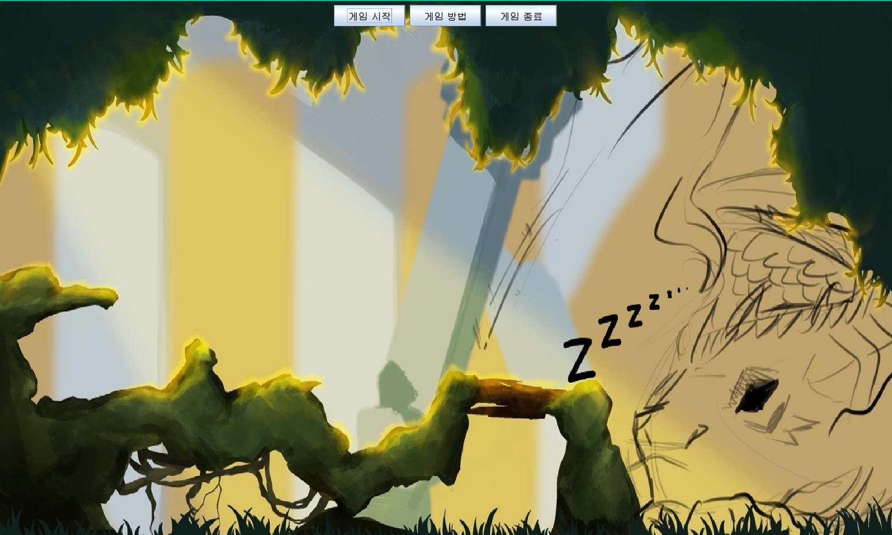
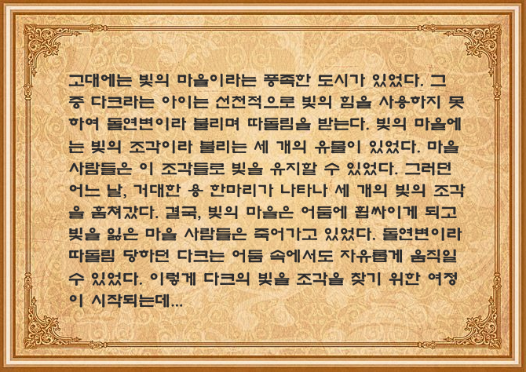
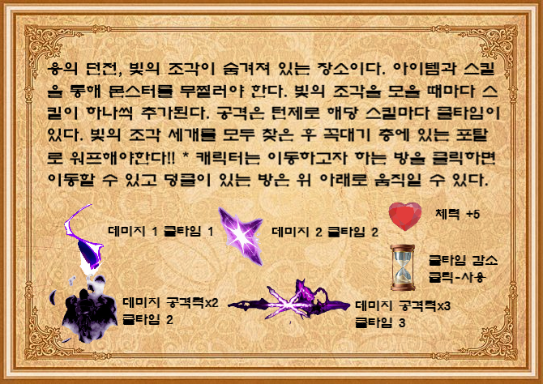
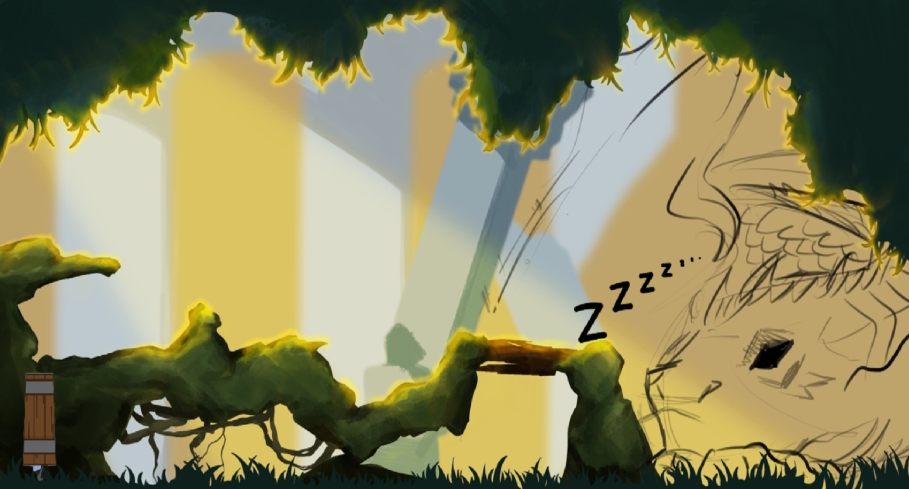

# Convenience-POS-System

소프트웨어학과 개인 게임 개발 프로젝트, 디자인과와의 협업

## 프로젝트명  
shadow

 

## 프로젝트 소개 
자바의 스윙, 스레드 및 액션/키 리스너를 이용하여 GUI기반의 게임을 개발

 

## 개발기간

실질적인 개발 기간 2023.09.28~2023.11.03
프로젝트의 시작 2023.01.13 군복무를 하며 프로젝트의 기반을 잡음. (협업 계획 회의 및 캐릭터 디자인&게임 기능 구현)

 

## 게임 줄거리

고대 빛의 마을의 다크라는 아이는 선천적으로 빛의 힘을 사용하지 못하였다. 이로 인해 따돌림을 받는다. 어느날, 용이 마을의 유물인 빛의 조각을 훔쳐가고 빛을 잃은 마을 사람들은 죽어간다. 유일하게 어둠 속에서 자유롭게 움직일 수 있었던 다크는 빛의 조각을 찾기위한 여정을 떠난다.

 
 

## 게임 구성도

1) GameMenu
 

* 게임 시작 화면
* ActionListner를 이용한 버튼 이벤트로 다른 Frame 생성 및 현재 창 종료 (버튼의 이벤트 - 게임시작(DragonFrame)/ 게임방법(HowToPlay)/ 게임 종료)

 

2)HowToPlay
 

* 게임방법을 알려주는 창
* 이미지 순서대로 게임 스토리, 스테이지1(DragonFrame), 스테이지2()에 대한 설명이다.
* ActionListner를 이용한 버튼 이벤트로 페이지의 이동을 구현
* -> 현재 페이지를 변수에 저장(page) - 오른쪽 버튼을 누르면 page++ / 왼쪽 버튼을 누르면 page--를 한 후에 repaint()
* -> 화면에 이미지를 출력하기 전에 switch문을 통해 page에 따라 해당 세 이미지 중 하나를 출력
* 버튼에 이미지를 넣어 디자인(롤 오버 시에 버튼이 더 어두워짐)

 

3) DragonFrame

* 게임의 첫 번째 스테이지
* 잠든 용의 눈을 피해 던전에 입장 해야함.
* 쓰레드를 통해 애니메이션을 구현!!
* 용이 잠에서 깨는 시간을 Math.random()의 난수를 이용하여 조정
* 키리스너를 이용하여 방향키 누를 시(keyPressed)에 이벤트를 발생(왼쪽 방향키 - leftFlag = true / 오른쪽 방향키 - rightFlag = true)
-> 쓰레드에서 두 플래그를 if문을 통해 확인한 후 leftFlag가 true이면 왼쪽으로 이동 rightFlag가 true이면 오른쪽으로 이동
* 방향키를 떼었을 경우(keyReleased), 두 플래그 모두 false (이동을 멈춤)

4) 
5) 
