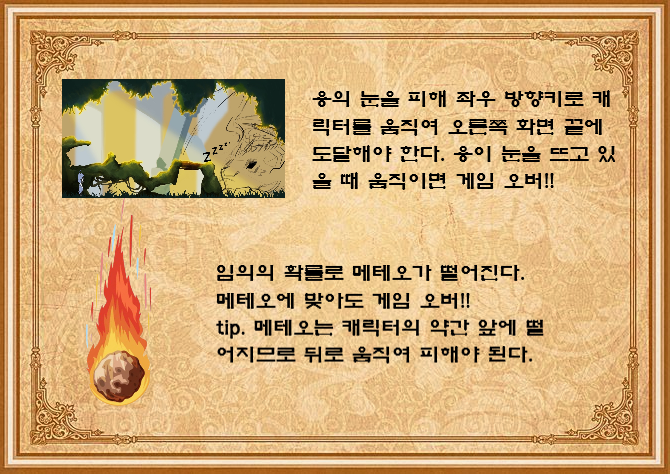

# Convenience-POS-System

소프트웨어학과 개인 게임 개발 프로젝트, 디자인과와의 협업

## 프로젝트명  
shadow(그림자를 기반으로 한 캐릭터에서 게임명을 고안)

 

## 프로젝트 소개 
자바의 스윙, 스레드 및 액션/키 리스너를 이용하여 GUI기반의 게임을 개발

 

## 개발기간

실질적인 개발 기간 2023.09.28~2023.11.03
프로젝트의 시작 2023.01.13 군복무를 하며 프로젝트의 기반을 잡음. (협업 계획 회의 및 캐릭터 디자인&게임 기능 구현)

 

## 게임 줄거리

고대 빛의 마을의 다크라는 아이는 선천적으로 빛의 힘을 사용하지 못하였다. 이로 인해 따돌림을 받는다. 어느날, 용이 마을의 유물인 빛의 조각을 훔쳐가고 빛을 잃은 마을 사람들은 죽어간다. 유일하게 어둠 속에서 자유롭게 움직일 수 있었던 다크는 빛의 조각을 찾기위한 여정을 떠난다.

 
 

## 게임 구성도

1) GameMenu
 

* 게임 시작 화면
* ActionListner를 이용한 버튼 이벤트로 다른 Frame 생성 및 현재 창 종료 dispose() (버튼의 이벤트 - 게임시작(DragonFrame)/ 게임방법(HowToPlay)/ 게임 종료)

 

2)HowToPlay
 

* 게임방법을 알려주는 창
* 이미지 순서대로 게임 스토리, 스테이지1(DragonFrame), 스테이지2()에 대한 설명이다.
* ActionListner를 이용한 버튼 이벤트로 페이지의 이동을 구현
* -> 현재 페이지를 변수에 저장(page) - 오른쪽 버튼을 누르면 page++ / 왼쪽 버튼을 누르면 page--를 한 후에 repaint()
* -> 화면에 이미지를 출력하기 전에 switch문을 통해 page에 따라 해당 세 이미지 중 하나를 출력
* 버튼에 이미지를 넣어 디자인(롤 오버 시에 버튼이 더 어두워짐)

 

3) DragonFrame
 

 
* 게임의 첫 번째 스테이지
* 잠든 용의 눈을 피해 던전에 입장 해야함.
* 쓰레드를 통해 애니메이션을 구현!!
* MainChracter 클래스를 이용해 캐릭터의 좌표, 크기 및 이미지를 가져 옴.
* 키리스너를 이용하여 방향키 누를 시(keyPressed)에 이벤트를 발생(왼쪽 방향키 - leftFlag = true / 오른쪽 방향키 - rightFlag = true)
  -> 쓰레드에서 두 플래그를 if문을 통해 확인한 후 leftFlag가 true이면 왼쪽으로 이동 rightFlag가 true이면 오른쪽으로 이동
  -> 쓰레드가 불려진 횟수를 cnt에 저장 : cnt 짝수 - 걷는 이미지 / 홀수 - 서있는 이미지 (걷는 것을 구현)
  ->  캐릭터 왼쪽 이동 - 왼쪽 보는 이미지 / 오른쪽 이동 - 오른쪽 보는 이미지
* 방향키를 떼었을 경우(keyReleased), 두 플래그 모두 false (이동을 멈춤)
* 용이 잠에서 깨는 시간 및 메테오가 떨어지는 확률을 Math.random()의 난수를 이용하여 조정
  -> Math.random()*2 - 0~1의 난수를 생성 0이 생성되었을 경우, 메테오를 떨어트림(캐릭터의 약간 앞에 떨어트려서 뒤로만 피할 수 있게 설정)
* 메테오가 캐릭터에 부딪혔을 때 게임 오버 시키기 위해서 사각형 겹치는지 여부를 확인하는 공식 사용(intersect)
  -> if(x1 + w1 >= x2 && x1 <= x2 + w2 && y1 + h1 >= y2 && y1 <= y2 + h2)

3-1) DragonFrame GameOver  (gameOverFlag가 true이면 GameOver 진행)
 
 
 
* 용이 눈을 뜨고 있을 때 움직였거나 떨어지는 메테오에 맞으면 키리스너를 모두 return시키고 캐릭터의 머리 위에 !아이콘을 출력 & 용이 눈을 계속 뜨고 지켜보고 있음.
* gameOverCnt를 이용하여 일정 시간이 지났을 때 GameOver화면을 출력
  -> DragonFrame 때와 같이 gameOverCnt에 따른 걷기 이미지 출력 달리는 것을 표현하기 위에 캐릭터 뒤에 흙먼지 dust.gif출력
  -> 캐릭터의 뒤에 flyingDragon.gif 출력 (용이 쫓아오고 있음을 표현)
* gameOverCnt가 일정 수를 넘었을 때 replay & menu버튼을 출력(이미지 절대 배치)
  -> 액션리스너를 통해 버튼 클릭 이벤트 구현 (Rectangle 클래스의 Contain(Point p)를 이용하여 내가 클릭한 좌표가 버튼의 구역 안에 있는지 확인)
  -> replay 클릭 시, 캐릭터의 위치와 DragonFrame에 이용되는 변수들 초기화(gameOverFlag=false)
  -> menu 클릭 시, 현재 창 dispose() & new GameMenu()

4) TempleFrame
 

 
* MainCharacter(주인공), Room(던전 방), Monster(몬스터), ItemBox(아이템 상자) 클래스를 이용해 각각 개체의 데이터를 관리함. (반복문으로 던전의 하나의 방 당 하나의 객체가 할당 된다. 인덱스로 층과 방 번호를 구분)
  - **Main Character** : 좌표, 크기, 이미지, 현재 위치(층 및 방 번호), 체력, 공격&방어력, 스킬 데미지&쿨타임, 아이템 및 스킬 보유 개수
  - **Room** : 몬스터&아이템 존재 여부, 위아래 이동 가능 여부, 방문 여부(방문O - 방이 밝고 몬스터 및 아이템이 보임 / 방문X - 방이 어둡고 방에 무엇이 있는지 보이지 않음)
  - **Monster** : 좌표, 크기, 이미지, 공격력, 체력, 존재여부(해당 방에 몬스터가 존재하는 지), 몬스터 식별 번호
  - **ItemBox** : 아이템 상자의 크기, 아이템 상자 및 아이템 이미지, 아이템 식별 번호, 존재여부(해당 방에 아이템 상자가 존재하는 지), 상자 개봉 여부 및 개봉되고 지난 시간(이미지 출력 시간 확인)
  -> 특정 아이템(빛의 조각, 공격력 및 방어력 증가) 지정 층에 생성되도록 설정, 방은 랜덤. 다른 아이템들은 갯수는 정해져있지만 위치는 랜덤(for 문의 반복횟수로 갯수를 조정 / 층 및 방은 Math.random()으로 난수 발생)
  -> 몬스터는 가장 강한 거미 몬스터만 특정 이상의 층부터 생성(난이도 조정) / 아이템 설정과 마찬가지로 for문과 난수를 통해 무작위로 배치

 
* 캐릭터의 체력과 공격력 방어력과 같은 기본 정보는 왼쪽 위에 출력 / 쿨다운 아이템은 오른쪽 위에 출력
* 마우스 리스너를 이용한 캐릭터의 이동 및 스킬&아이템 사용 (마우스 클릭 이벤트)
  - 캐릭터가 위치한 방에 인접한 방을 클릭하면 이동한다. (위아래로 이동할 경우 Frame의 높이(H)/3 만큼을 이동 | 옆으로 이동할 경우 Frame의 너비(W)/3 만큼을 이동)
  -> 캐릭터 상하 이동 시에 이동전의 방의 위치를 기준으로 필드에 y를 설정 (이동 전에는 y=0 / y는 이전 위치에서 상하로 이동한 좌표를 의미)
  -> 애니메이션 과정에서 층이 바뀌면서도 room의 정보를 가져오기 위한 설정!!
  -> y 좌표가 0이상이면 위로 이동하고 있음을 의미, 반대로 0이하이면 아래로 이동
  -> y>0 : 현재 층(floor)+2에 해당하는 방 또한 출력하여야 함. 화면의 상단에 floor+2층이 y만큼만 보여야 하므로 해당 방의 y좌표 = 0 & 높이 = y
  -> y<0 : 현재 층(floor)-2에 해당하는 방 또한 출력하여야 함. 화면의 하단에 floor-2층이 y만큼만 보여야 하므로 해당 방의 y좌표 = frame의 높이(H)-y & 높이 = y
  - 메인 캐릭터는 공격 턴에 머리 위에 스킬 선택 창이 생성 되고 특정 스킬 클릭 시 스킬 사용 (MainCharacter의 좌표에 기반한 위치 설정)
* 쓰레드를 이용한 애니메이션
  - 몬스터는 공격 시에 포물선을 그리며 도약한 후 내려찍고 제자리로 돌아옴.
  - 캐릭터가 공격 받았을 때 공격 받은 캐릭터 위에 공격자 및 스킬 선택에 따른 스킬 이미지가 출력되고 캐릭터는 데미지를 입으며 어두워졌다 밝아졌다를 반복
* 아이템 박스는 몬스터의 존재 여부를 확인 후 몬스터가 해당 방에 없다면 아이템 획득 가능
* 캐릭터가 빛의 조각을 모두 가지고 꼭대기 층 맨 오른쪽 방에 있는 포탈에 도달하면 게임은 끝이 난다.

 

4-1) TemPleFrame GameOver
 

 
* 캐릭터의 체력이 0이하로 떨어졌을 때 게임이 오버된다.
* 게임 오버 화면이 위에서 아래로 내려오는 애니메이션을 구현(쓰레드를 통해 일정 시간마다 게임 오버 화면의 높이(h)를 늘려준다. "게임오버 화면의 높이 >= 전체 화면의 높이"가 될 때까지)
* 게임 오버 화면이 출력된 후, 캐릭터가 중앙에 위치하고 DragonFrame과 마찬가지로 키보드 좌우방향키로 캐릭터를 움직일 수 있다.(캐릭터 애니메이션 알고리즘 또한 동일 - 키리스너 사용)
* 양 사이드에는 '게임 다시 시작하기'와 '메인메뉴로' 버튼을 배치하였다. 캐릭터가 특정 버튼의 중앙에 위치하였을 때 두 선택지 중 하나가 선택이 된다.(키리스너에서 캐릭터와 버튼 위치 비교)
